# ExploreNation

ExploreNation is a travel app that helps you find and explore amazing attractions around the world or near you. Whether you want to visit a famous landmark, a hidden gem, or a local hotspot, ExploreNation can help you discover it. You can also learn more about the cities and countries you want to visit by searching for them on the app. ExploreNation is designed to be informative and easy to use, so you can plan your trips and enjoy your adventures.

### Screens

<table>
  <tr>
    <td>
      <h3>Splash</h3>
      
      
This screen displays an animated globe with an airplane flying around it. The globe and the airplane symbolize the adventure and excitement of traveling.

    </td>
    <td>
      <h3>Welcome</h3>
      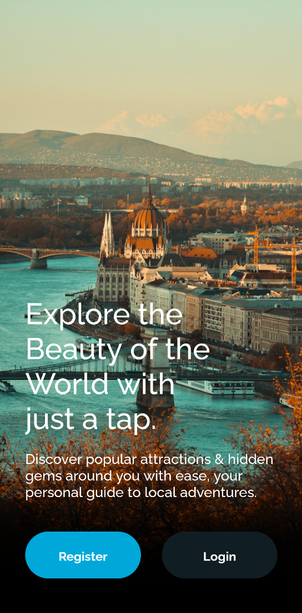
      
This screen contains buttons to login if you have an account or to register if you don't. The background will cycle through images of beautiful destinations around the world along with a fun title and description about the app.

    </td>
  </tr>
  <tr>
    <td>
      <h3>Login</h3>
      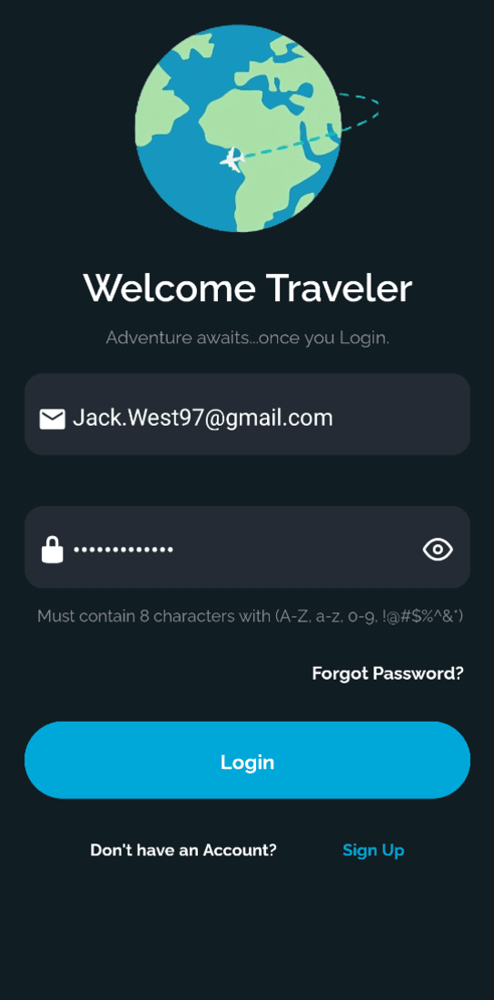
      
This screen displays a text field for users to enter their email and password to login to the app.
      Users can ensure that they will be able to login successfully with the built in error handling for both server error and mistyped credentials.

    </td>
    <td>
      <h3>Register</h3>
      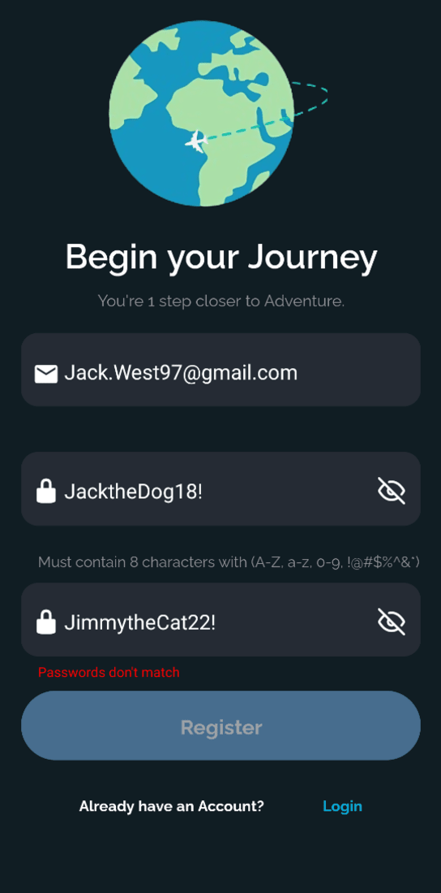
      
This screen displays a text field for users to enter their email, a password they would like to use and confirm the password before registering. Users can ensure that any errors that occur during this process will be handled and displayed back to the user what the issue is.

    </td>
  </tr>
  <tr>
    <td>
      <h3>Forgot Password</h3>
      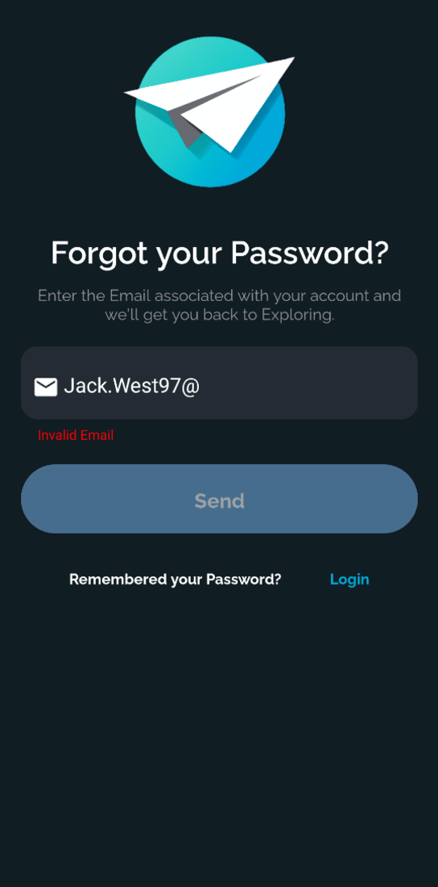
      
This screen displays a text field where a user can enter their email and a password reset link will be emailed to them. Clicking on the link will allow the user to access the reset password screen. Any errors for entering an email are displayed to the user if they occur.

    </td>
    <td>
      <h3>Reset Password</h3>
      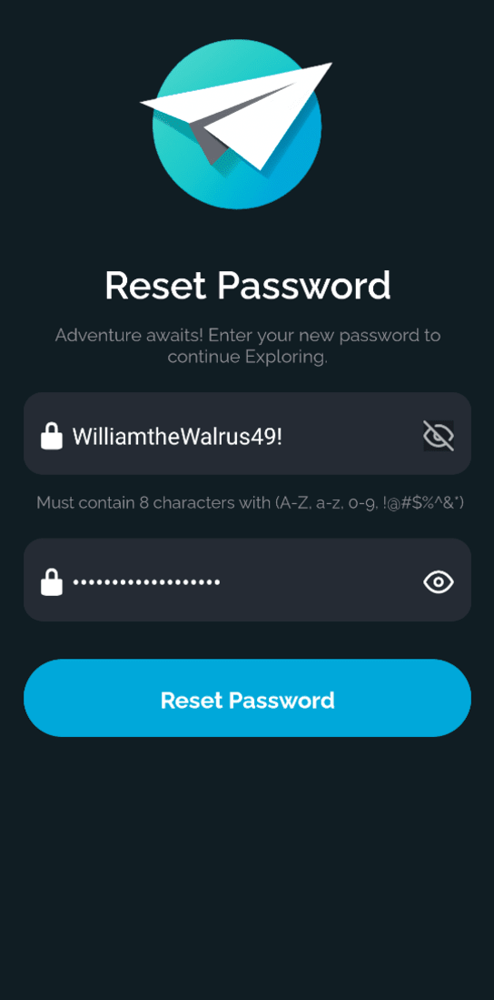
      
This screen displays 2 text fields where a user can enter and confirm their new password.

    </td>
  </tr>
  <tr>
    <td>
      <h3>Check Email</h3>
      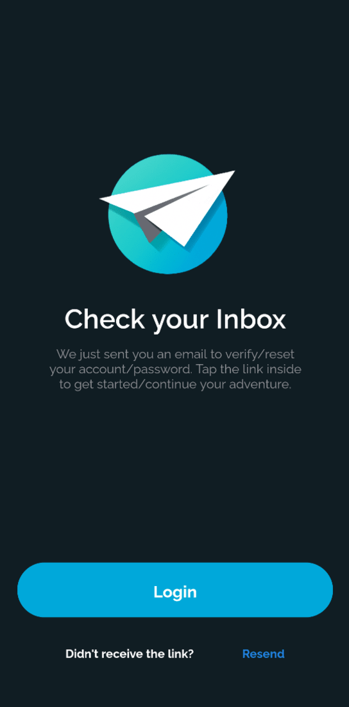
      
This screen displays a reminder message to the user to check their email for the link to reset their password or verify their account after registering.

    </td>
    <td>
      <h3>Home</h3>
      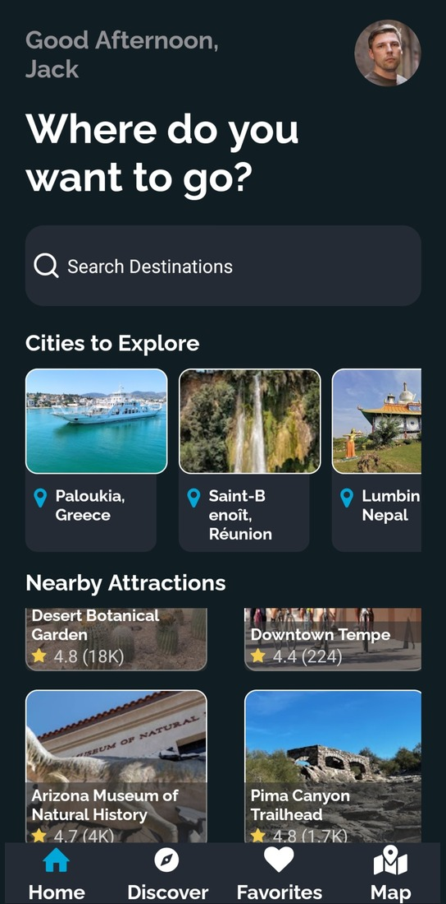
      
Upon logging in, users will be greeted by a message depending on the time of day the user logs in. Selecting the user’s profile icon in the top right will open a separate menu for accessing settings and to log out. Users will be able to search for a city or country they have in mind with the built in search bar. A list of cities around the world whether they are big or small will be presented to the user. If a user grants the app access to their location, attractions that are nearby will be populated at the bottom of the screen.

    </td>
  </tr>
  <tr>
    <td>
      <h3>Discover</h3>
      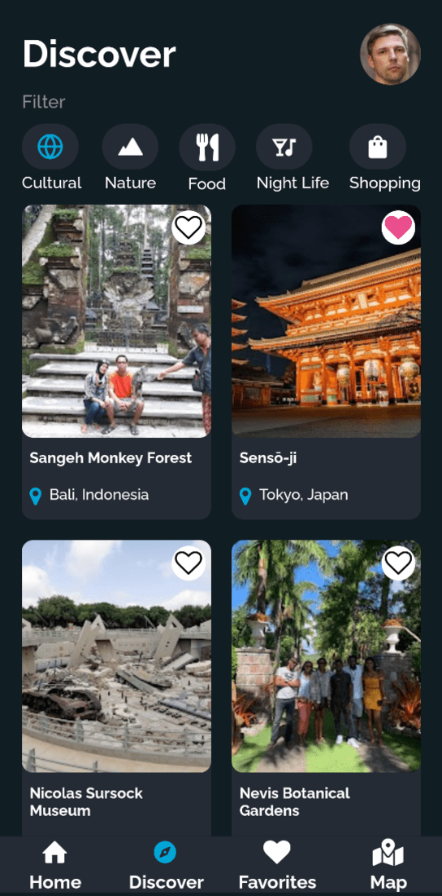
      
This screen will display different attractions from around the world  based on the filter that the user selects at the top of the screen. 5 Different filters are available for the user to choose from, these filters include Cultural, Nature, Food, Night Life and Shopping. If a user likes one of the attractions displayed they can favorite it and view it later.

    </td>
    <td>
      <h3>Favorites</h3>
      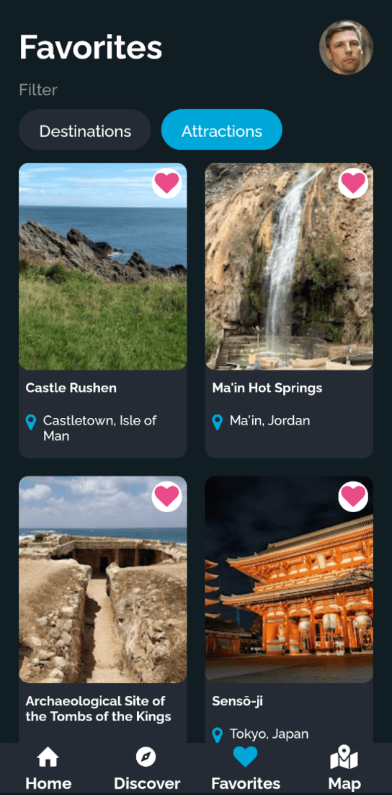
      
This screen will display all the attractions or destinations a user has favorited while using the app. Users can filter what favorites they are viewing using the filter buttons on the top of the screen. Users can filter based on destination or attractions.

    </td>
  </tr>
  <tr>
    <td>
      <h3>Attraction Details</h3>
      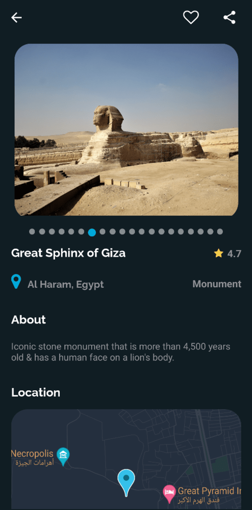
      
This screen displays a carousel of images, the name of the city the attraction is located in, the star rating, a description, a map of the location as well as the type of attraction. In the header of this screen users are able to favorite the attraction as well as share this attraction and it’s location to social media.

    </td>
    <td>
      <h3>Destination Details</h3>
      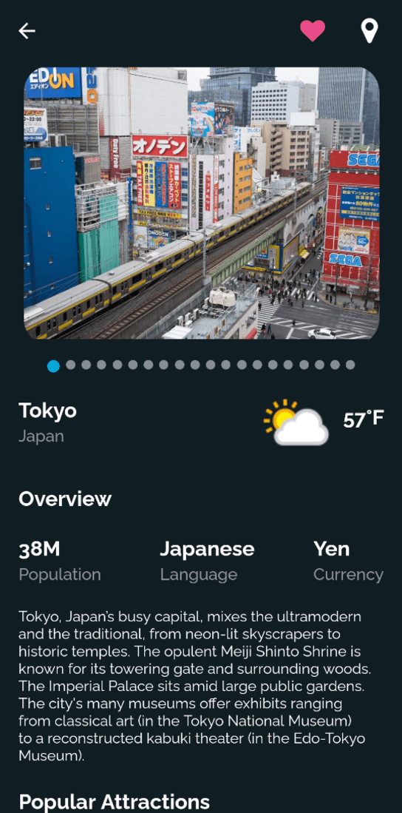
      
This screen displays a carousel of images, basic info about the destination selected, description and popular attractions for the destination selected. Some of the basic info that is presented include name of the destination, population, language spoken, currency used, weather condition, capital and flag (If the destination is a Country). In the header on the top of the screen, users can favorite the destination as well as open the map with the destination preselected.

    </td>
  </tr>
  <tr>
    <td>
      <h3>Map</h3>
      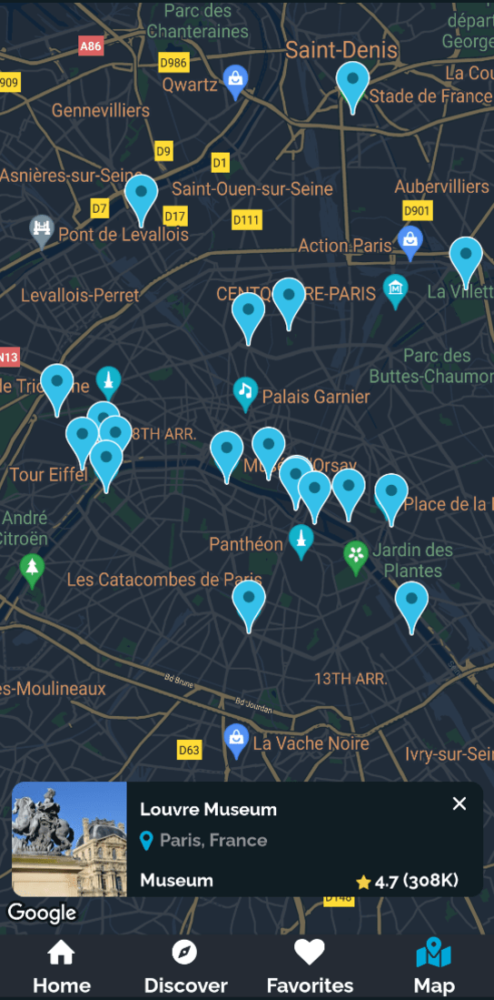
      
This screen displays a full screen map that allows users to have the freedom to zoom in and out on different countries and cities. Upon zooming in on a city a small amount of attractions will be shown based on the zoom level the user is on. Selecting a pin that is visible on the map will display brief info about the attraction.

    </td>
    <td>
      <h3>Settings</h3>
      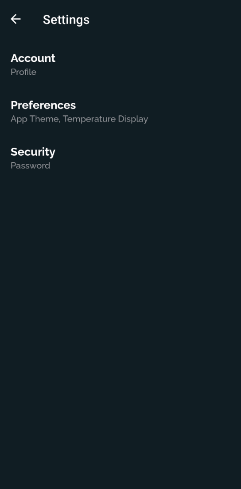
      
This screen contains 3 different sections, each with different options to change. Users can choose between Account, Preferences or Security to make changes that will suit their needs. The Account section allows users to update their profile picture or username. In the Preferences section, users can customize the app’s appearance. They can choose between light or dark mode for the color theme, and select Fahrenheit or Celsius for the temperature unit display when looking at a destination. The Security Section allows users to update their current password.

    </td>
  </tr>
</table>
